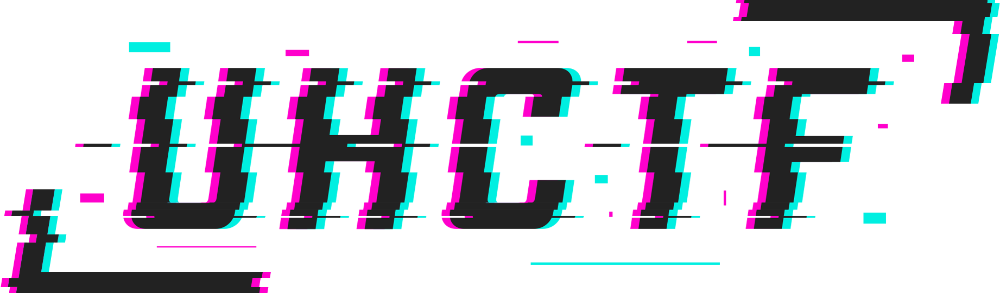

<p align="center"></p>

# UHCTF Jr

*Nederlands: zie [README.md](README.md).*

Material for the outreach and junior events of [UHCTF](https://uhctf.be).
We make security approachable and fun for children and teens, through digital and physical challenges.

## Structure

- [challenges/](challenges/): reusable challenges. One folder per challenge, with a README and a SOLUTION.
- [events/](events/): a specific event in a given format. An event picks challenges from `challenges/` and describes schedule, materials and scoring.

| Event | Audience |
| --- | --- |
| [Dag van de Wetenschap](events/dag-van-de-wetenschap/) | families, children and teens |
| [Young Adult Workshop](events/workshop-jongvolwassenen/) | young adults |
| [Teen Showcase](events/tienerdemo/) | teens |

## Principles

- Dutch is the main language. Some challenges or events are available in multiple languages (e.g., Dutch `README.md` and English `README.en.md`).
- Low prerequisites. Preferably everything works offline in the browser or on paper.
- Flags are preferably just the answer (like a riddle). The `uhctf{...}` format can be used for older participants.

## License

- Challenges, documentation and printable material: [CC BY-NC-SA 4.0](LICENSE-CONTENT)
- Code: [MIT](LICENSE)
- Commercial use? Get in touch via [uhctf.be](https://uhctf.be).

## Getting started

```
./jr setup                          # once: virtual environment and requirements
./jr list                           # all challenges
./jr build doolhof                  # build a challenge with its default answer
./jr event add my-event doolhof --antwoord kangoeroe
./jr event build my-event           # PDFs + answer list in events/my-event/out/
```

Generated challenges always have a default answer, but each event can pick its own. Static challenges have fixed material.

## Contributing

See [CONTRIBUTING.md](CONTRIBUTING.md).
